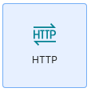

# Backend Documentation Goes Here

## 🌱 1. Spring Boot Setup

- Navigate to the `cash_control/backend` directory.
- From inside of the `backend` directiory:
  
```bash
curl https://start.spring.io/starter.zip \
  -d dependencies=web \
  -d type=maven-project \
  -d language=java \
  -d name=cashcontrol \
  -d packageName=com.cashcontrol \
  -d baseDir=. \
  -o temp.zip && unzip -o temp.zip && rm temp.zip
```

## 🗃️ 2. H2 Database Setup

To use the in-memory H2 database for local development and testing, follow these steps:

### 🔧 A. Download & Install H2

- Go to 
- Download the Platform-independend zip form the Maven section(e.g., `h2-2024-08-11.zip`)
- Extract it to the directory of your choice.

### ▶️ B. Launch the H2 Console

From inside the extracted `h2-2024-08-11/h2` directory:

```bash

cd h2-2024-08-11/h2
chmod +x ./bin/h2/sh # Only needed once to make the script executable
./bin/h2.sh

```

This launches the web-based H2 console at http://localhost:8082

### ⚙️ C. `application.properties` Configuration

In your Spring Boot project(`/backend/src/main/resources/application.properties`):

```properties

spring.application.name=cashcontrol
spring.h2.console.enabled=true
spring.datasource.url=jdbc:h2:mem:dcbapp
spring.datasource.driver-class-name=org.h2.Driver
spring.datasource.username=sa
spring.datasource.password=password

```

Make sure your `application.properties` file matches!

### ✅ D. Accessing the Console

- Navigate to http://localhost:8082
- Use these credentials:

| Field | Value |
| ----- | ----- |
| JDBC URL | `jdbc:h2:mem:dcbapp` |
| User Name | `sa` |
| Password | `password` |
| | |

Click Connect to explore the in-memory database.

**Additional Resource:** https://www.geeksforgeeks.org/spring-boot-with-h2-database/#

## 🔥 3. Start the Spring Boot Server

- Navigate to the `cash_control/backend` directory.
- From inside of the `backend` directory:

```bash
chmod +x mvnw # Only needed once to make the script executable
./mvnw spring-boot:run

```

- This will automatically seed the database using the `/src/main/java/com/cashcontrol/config/DatabaseSeeder.java` file.

## 📊 4. Accessing Seeded Data

Once you've started the Spring Boot server and seeded some test data, you can view the data in two ways:

### 🌐 Option 1: View via REST API

The app exposes a REST endpoint to fetch all users:

- Open your browser and go to: http://localhost:8080/api/users
- You should see a list of users in JSON format like:

```json

[
  {
    "userId": 1,
    "name": "Alice Johnson",
    "email": "alice@example.com",
    "createdAt": 1712345678901
  },
  ...
]

```

### 🖥️ Option 2: View Via Postman

- Launch Postman
- Create a new request: 
  - Go to: `file > New...` 
  - Select `http` 
  - 
  - Method: `Get`
  - URL: `http://localhost:8080/api/users` 
  - 
- Click **Send**
- You should recieve a response witht the list of seeded upsers form the database in JSON format.
- 

Use the same basic instructions for other methods: `Post`, `Put`, `Delete`...

## 🛑 5. Stop the Backend

- Navigate to the `cash_control/backend` directory.
- From inside of the `backend` directory:

```bash

Command + C

```

